# GitHub Contribution Graph
- per: https://github.com/LambdaSchool/Code-Review-Checklist

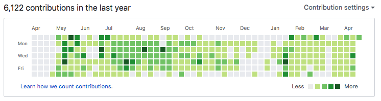

### Please take a moment to review GitHub's "[Learn How We Count Contributions](https://help.github.com/articles/why-are-my-contributions-not-showing-up-on-my-profile)" page. In particular the "[Commit Was Made In A Fork](https://help.github.com/articles/why-are-my-contributions-not-showing-up-on-my-profile/#commit-was-made-in-a-fork)" section. If you'd like all of your work to be reflected on your GitHub Contribution Graph, you can do the following:

### "De-Forking" Your Project

1. **DO NOT DELETE YOUR LOCAL PROJECT!**
2. If you want your new and "non-forked" GitHub project name to match the old project name, first [rename](#how-to-rename-your-old-github-repo) or [delete](#how-to-delete-your-old-github-repo) your forked GitHub repository. Do this _**on**_ GitHub. You can access the renaming and deleting options on GitHub in the "Settings" tab of your fork. Don't worry, if you delete your GitHub fork, your local copy will be safe.
3. Create a new empty repository on GitHub. You are welcome to name it whatever makes sense to you. If you have renamed or deleted the old one, you can give it the same name of the original Lambda School project you are "de-forking" from.

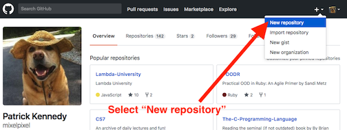
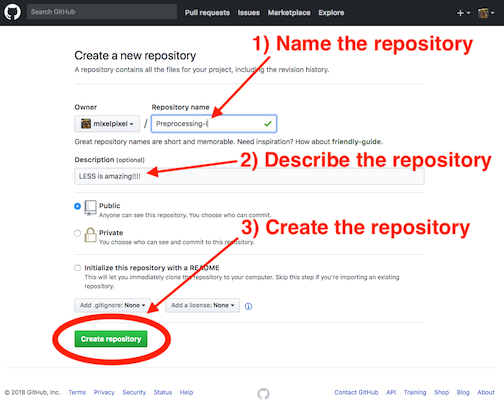
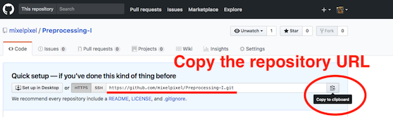

4. Add the new (and empty) GitHub repository as the "origin" remote to your local git repository.

```console
$  git remote -v
   origin  https://github.com/LambdaSchool-PairStudentA/Preprocessing-I.git (fetch) <--- OLD ORIGIN URL
   origin  https://github.com/LambdaSchool-PairStudentA/Preprocessing-I.git (push) <---- OLD ORIGIN URL
                              ^^^^^^^^^^^^^^^^^^^^^^^^^
$  git remote set-url origin https://github.com/mixelpixel/Preprocessing-I.git <-------- SET NEW ORIGIN URL
$  git remote -v
   origin  https://github.com/mixelpixel/Preprocessing-I.git (fetch) <------------------ VERIFY NEW ORIGIN URL
   origin  https://github.com/mixelpixel/Preprocessing-I.git (push) >------------------- VERIFY NEW ORIGIN URL
                              ^^^^^^^^^^
```

5. Push your local project to the new GitHub repository.

```console
$  git push origin master
   Counting objects: 111, done.
   Delta compression using up to 4 threads.
   Compressing objects: 100% (77/77), done.
   Writing objects: 100% (111/111), 594.93 KiB | 45.76 MiB/s, done.
   Total 111 (delta 27), reused 111 (delta 27)
   remote: Resolving deltas: 100% (27/27), done.
   To https://github.com/mixelpixel/Preprocessing-I.git
   * [new branch]      master -> master
```

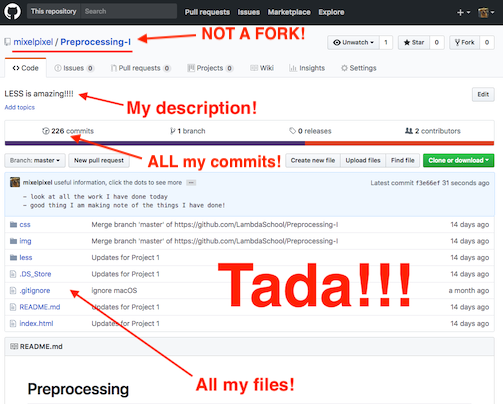

### BEFORE:

  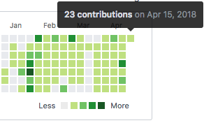

### AFTER:

  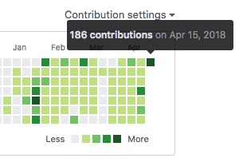

***

# How to RENAME your old GitHub Repo.

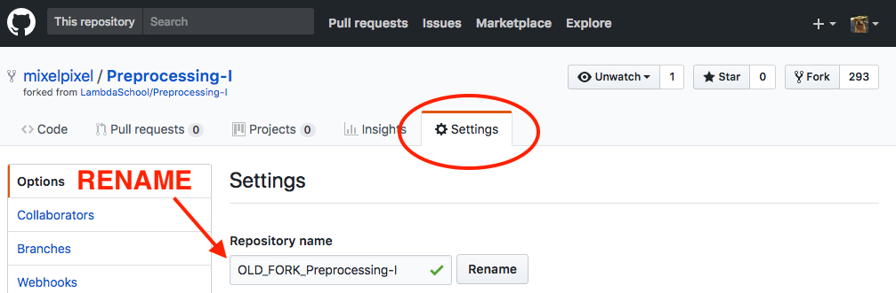

<p align="right"><a href="#de-forking-your-project">Go back to "De-Forking"</a></p>

***

# How to DELETE your old GitHub Repo.
1. Select the "Settings" tab.

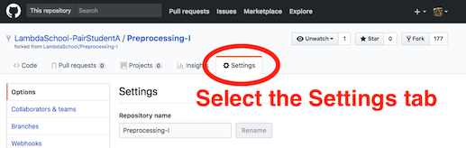

2. Scroll down to "The Danger Zone."

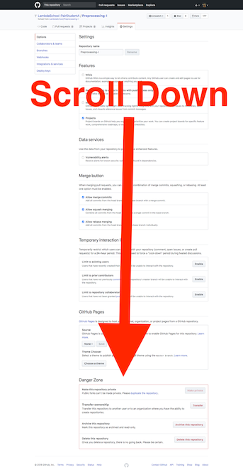

3. Press the red button!

[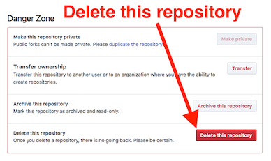](https://youtu.be/siwpn14IE7E)

:point_up: Click :point_up: on :point_up: this :point_up: picture :point_up: before you enter "The Danger Zone" :+1:

4. Confirm you are not a robot and press the [BIG RED BUTTON](http://abstrusegoose.com/10)!

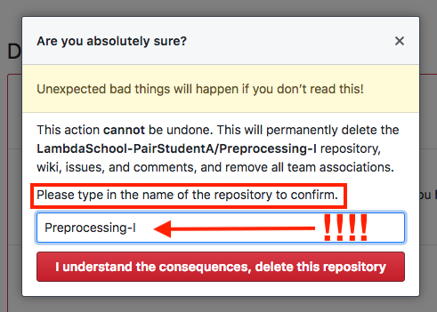

<p align="right"><a href="#de-forking-your-project">Go back to "De-Forking"</a></p>

:octocat:
